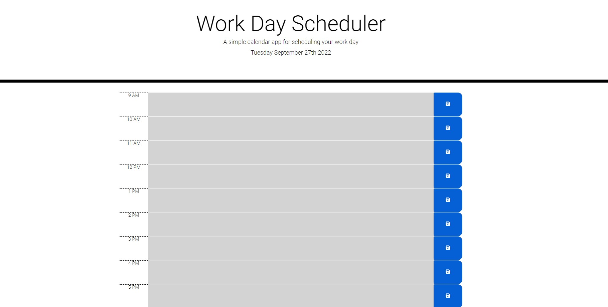

# Work Day Scheduler
## Description
Work Day Scheduler is a simple calendar application that allows users to save events for each hour of the day. This app runs  in the browser and features dynamically updated HTML and CSS powered by jQuery.

## Deployed URL
https://malickbax.github.io/workday-planner/

## User Story
- As an employee with a busy schedule, I want to add important events to a daily planner so that I can manage my time effectively.
  When I open the planner, then the current day is displayed at the top of the calendar. When I scroll down, I am presented with time blocks for standard business hours.
  When I view the time blocks for that day, each time block is color-coded to indicate whether it is in the past, present, or future. 
  When I click into a time block, I can enter an event.
  When I click the save button for that time block, the text for that event is saved in local storage.
  When I refresh the page, the saved events persist.
  
## Screenshot

## Tests
- No test is required. Application is deployed and ready for usage.

## Questions
**Malick Ba**

For more projects, please visit my [GitHub page](https://github.com/malickbax) 
